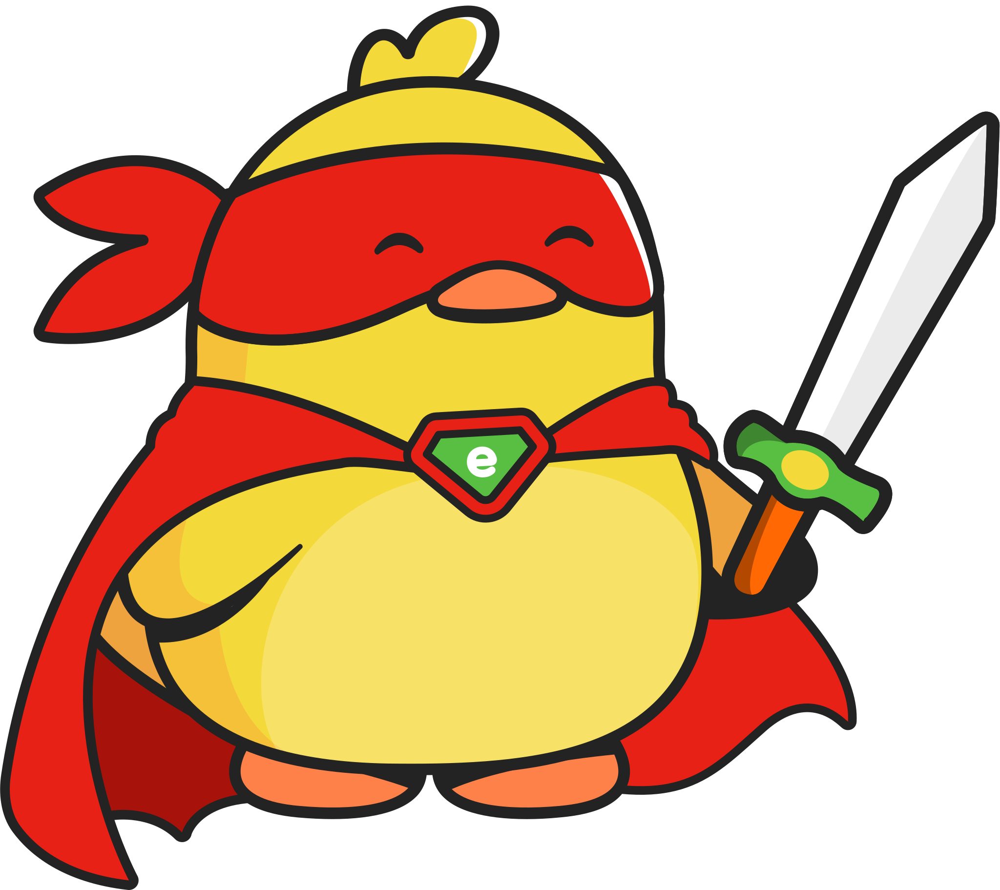

<p align="center">
  
</p>

<h1 align="center">Entegrity</h1>

<p align="center">
  <b>Send secrets through a game. End-to-end encrypted. Zero servers. Pure fun.</b>
</p>

<p align="center">
  <a href="https://entegrity.gg">entegrity.gg</a>
</p>

---

**Entegrity** is an encrypted messaging platform disguised as a 2D platformer. Encrypt a photo or letter, share a link, and your recipient must fight through 5 levels as a duck knight to unlock the secret.

No accounts. No servers storing your data. The entire encrypted payload lives in the URL.

## How It Works

```
You (Sender)                          Them (Recipient)
─────────────                         ─────────────────
Upload photo or write letter    →     Click the link
Content encrypted with AES-GCM →     Play 5 platformer levels
Get a shareable link            →     Collect key fragments per level
Share it                        →     All 5 fragments decrypt the secret
```

### Encryption

- **AES-256-GCM** symmetric encryption via the Web Crypto API
- **PBKDF2** key derivation (100,000 iterations, SHA-256)
- A random 10-character seed generates a deterministic 5-character game key
- Each level completion reveals one character of the key
- Everything happens client-side — nothing touches a server

## Gameplay

You play as a **duck knight** armed with a sword, a dash, and a parry — battling through 5 themed levels inspired by internet privacy threats.

### Controls

| Action | Keys |
|--------|------|
| Move | `Arrow Keys` / `WASD` |
| Jump | `Up` / `W` |
| Attack | `Z` / `J` |
| Dash | `X` / `K` |
| Parry | `C` |

### The 5 Levels

| # | Level | Enemy | Threat |
|---|-------|-------|--------|
| 1 | **Cookie Caves** | Cookie Monsters | Tracking cookies |
| 2 | **Tracker Tunnels** | Tracker Bots | Laser-shooting trackers |
| 3 | **Ad Mines** | Ad Bots | Flying ad bombardment |
| 4 | **Phishing Depths** | Phishers | Movement-disrupting lures |
| 5 | **Algorithm Core** | The Algorithm (Boss) | 3-phase final boss |

Each level ends at a **vault door** — defeat all enemies to open it and claim your key fragment.

## Tech Stack

| Layer | Technology |
|-------|-----------|
| Game Engine | **Phaser 3** (v3.60.0) |
| Encryption | **Web Crypto API** (AES-GCM + PBKDF2) |
| Frontend | Vanilla HTML / CSS / JS |
| Sprites | Hand-drawn SVG assets |
| Hosting | Static files — works anywhere |

## Project Structure

```
├── index.html              # Main app (client-side only, everything in the URL)
├── data-breach/            # Extended version with Supabase backend
│   ├── index.html          # Server-backed variant (shorter links, auto-expiry)
│   ├── assets/             # 50+ SVG sprites & PNG backgrounds
│   └── server.js           # Express server
├── server.js               # Simple static file server
├── CNAME                   # entegrity.gg
└── package.json
```

## Run Locally

```bash
# Clone
git clone https://github.com/ente-toys/Entegrity.git
cd Entegrity

# Option 1: Just open it
open index.html

# Option 2: Run with server
npm install
node server.js
# → http://localhost:3000
```

No build step. No bundler. No framework. Just open the HTML.

## Architecture

```
┌─────────────────────────────────────────────────────┐
│                    SENDER FLOW                       │
│                                                      │
│  Photo/Letter → Compress → Generate Seed → Derive   │
│  Key → AES-GCM Encrypt → Encode to Base64 →         │
│  Embed in URL Hash → Share Link                      │
└──────────────────────┬──────────────────────────────┘
                       │
                       ▼
┌─────────────────────────────────────────────────────┐
│                  RECIPIENT FLOW                      │
│                                                      │
│  Click Link → Parse Hash → Extract Seed →            │
│  Play Level 1 → Fragment 1 revealed                  │
│  Play Level 2 → Fragment 2 revealed                  │
│  Play Level 3 → Fragment 3 revealed                  │
│  Play Level 4 → Fragment 4 revealed                  │
│  Play Level 5 (Boss) → Fragment 5 revealed           │
│  Assemble Key → AES-GCM Decrypt → View Secret       │
└─────────────────────────────────────────────────────┘
```

## Why?

Because sending secrets should be fun. No one reads privacy policies, but everyone plays games. Entegrity makes encryption tangible — you *earn* your decryption key one level at a time.

---

<h3 align="center">Built by</h3>

<table align="center">
  <tr>
    <td align="center">
      <a href="https://github.com/heisenbergg-labs">
        
        <br />
        <b>heisenbergg</b>
      </a>
    </td>
    <td align="center">
      <a href="https://github.com/Antara-Paul04">
        
        <br />
        <b>Antara</b>
      </a>
    </td>
  </tr>
</table>
